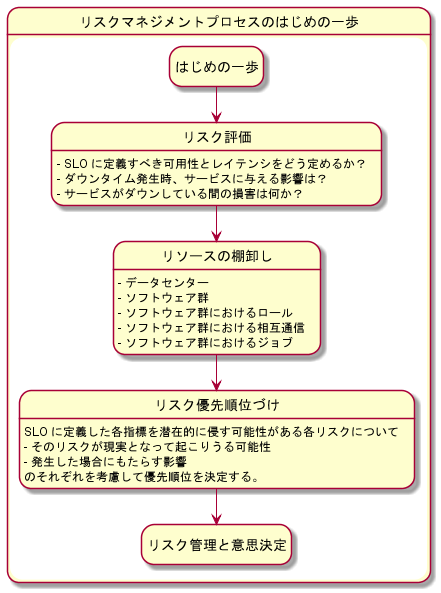
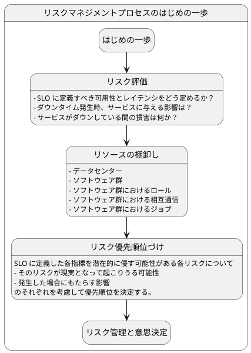
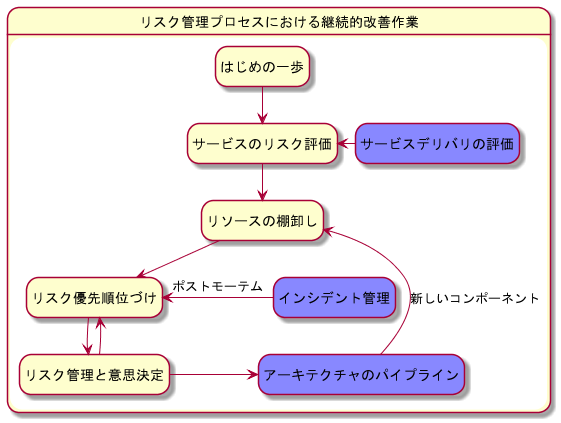
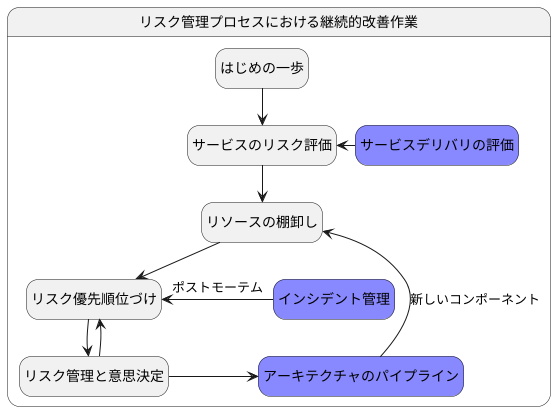

[O'Reilly Japan - データベースリライアビリティエンジニアリング](https://www.oreilly.co.jp/books/9784873119403/) の 3 章の読書メモです。

## 3. リスクマネジメント

オペレーションの本質は、SLO を遵守すること。
リスクマネジメントとは、以下のような問題を解決していくこと。

- SLO 違反となる不確定要素をどのように扱うか
- サービスを運用する上で、不確定要素をどのように発見し、その影響を見積もり、どう優先順位をつけるか
- ヒト・モノ・カネ・テクノロジーといったリソースをどのように活用するか

ただし、すべてのリスクを取り除くことは、風車に突進するドン・キホーテさながら (=無謀)。

引用: [File:Don Quixote Attacking the Windmill MET DP868289.jpg - Wikimedia Commons](https://commons.wikimedia.org/wiki/File:Don_Quixote_Attacking_the_Windmill_MET_DP868289.jpg)

目指すのはリスクを適切に評価し、それを軽減するための手法と、リスクそのものの影響範囲を小さくすること。
そのために、インシデントの発生、新技術の採用の度に継続してリスクを評価し、軽減方法を考察する必要がある。

このサイクルは主に次の 7 つに分類できる。

> - 潜在的な障害や脅威となるリスクを洗い出し、一覧を作成する。
> - 各リスクについて発生する可能性と発生時の影響度について評価する。
> - 発生する可能性と発生したときの結果をそれぞれ分類する。
> - 発生する可能性をどうやったら低くすることができるか、また、発生したときサービスに与 える影響を軽減する方法について洗い出す。
> - 各リスクについて優先順位をつける。
> - 監視と対応策を実装する。
> - 上記を繰り返す。
>
> (P35)

このプロセスを繰り返すことで、カイゼンのレールに乗れる。

### 3.1. リスク評価

リスク評価のプロセスに影響を与える主な要因は以下の 4 つ。

> - 不確定要素と複雑性のリスク
> - リソース不足とリソースマネジメント
> - 個人にまつわるリスク
> - 集団にまつわるリスク
>
> （ページ 36)

#### 3.1.1. 不確定要素と複雑性のリスク

システムの複雑化により、リスク評価も難しくなっている。
また、システムの複雑さ故に、業務の習得ハードルもあがっている。

複雑さに立ち向かうには、基本から理解を積み上げる必要がある。
ただし、以下のような不確定要素がもたらす影響は、対応が難しい。

> - AWS や GCP といったクラウドインフラストラクチャの影響
> - 使用しているハードウェアベンダによる影響
> - エンジニアによる間違ったコードのデプロイの影響
> - マーケティングチームによる突発的な負荷の影響
> - サービス立ち上げ時、もしくは終了時に伴う影響
> - 使用しているソフトウェアのバージョンアップによる影響
>
> （ページ 36).

#### 3.1.2.リソース不足とリソースマネジメント

限られた時間でリスクマネジメントを行うには、徹底的な優先順位づけが必要。
最も起こりやすく、最もサービスに影響のあるリスクに絞り、障害が発生しても直ぐに回復可能なシステムを構築する。

#### 3.1.3. 個人にまつわるリスク

[人間が持つ潜在的リスク](https://www.hse.gov.uk/humanfactors/resources/risk-assessment.htm)にも注意を向ける。

- 無気力症候群
  - リスクを回避したがる同僚や管理職に囲まれている人もいる
  - これらの人々は**何かをするのは、何かをしないよりもリスクが高い**と考えている
  - 何もしないことがリスク回避と言えるのか、客観的に数字を通してみることが大切
- ありふれたリスクを無視する
  - 経験豊富なエンジニアはしばしば、ありふれたリスクを無視しがち
  - 例: データセンターを横断して発生しうるすごいリスクに備える反面、逼迫しつつあるディスクの空き容量については、何も計画を立てようとしない
- 不安
  - 個人によって不安への対処は異なる
  - 不安からストレスを感じるあまり、最悪のシナリオを考えない人もいる
  - これは深刻なリスクに対する準備不足を招く
  - そのため、人によって不安への捉え方が違うことことを理解し、適切なリアクションをとるべき
- 極端な楽観主義
  - 事故を対岸の火事と認識しがち
  - その結果、人は疲れない、事故は起きない、人は補充されると幻想を抱くことがある
  - これはサーバーに対しても当てはまる
  - 同時に複数のサーバーが落ちることもあり得る
- 疲労
  - 厄介なのは、一時的な問題解決(=火消し)
  - 火消しを続けると、エンジニアは摩耗する
  - アラート疲れ: 本来対応する必要のないアラートにより無駄に疲弊すること。適切な閾値と頻度で監視する必要がある

#### 3.1.4. 集団にまつわるリスク

- 赤信号、みんなで渡れば怖くない (group polarization, 集団極性化)
  - リスクに対して、極端に寛容であったり、ひどく忌避したいする集団思考がある
  - 個人では危ないと思っても、集団になると必要以上にリスクを許容したり忌避したりする傾向がある
- きっと誰かがやてくれる (risk transfer, リスク転移)
  - そのリスクを担当するチームがいる場合、そのリスクに対するリスクを許容しがち
  - リスクを他人事と捉えない
  - 対応策: チームの壁を超えたクロスファンクショナルチームを作る
- 他人任せの意思決定 (decision transfer)
  - リスクを過大評価する場合、意思決定をほ他の誰か(CTO など)に委ねてしまうことがある
  - この結果、意思決定のバケツリレーが連鎖することも起こりうる
  - 意思決定においては、役職と承認プロセスよりも、個人の経験と専門知識を重視した自律的な組織を目指すことが大切

### 3.2. どうすればいいの？

どんなにリソースがあっても、すべてのリスクを防ぐのは不可能。
リスク管理のプロセスを確立し、時間を書けてカイゼンすることで、最終的にリスクを軽減できるようにする。

また、絶えずリスクに晒されているからこそ、柔軟で回復力のある、未知のリスクに対応可能なシステムができあがる。

[Google が発案したエラーバジェット](https://sre.google/workbook/alerting-on-slos/#low-traffic-services-and-error-budget-alerting)をリスク対応用に使用するという方法もある。
Google では、四半期に 30 分のダウンタイムをエラーバジェットとして計上している。
そして、定期メンテナンスや新機能のリリース、大掛かりの改善を施すときに、このエラーバジェットの消費を考慮する。

徹底的なリスク回避より、ある程度のリスク (この場合はダウンタイム) を許容するほうが健全。

> 簡単に言うと、エラー バジェットは、ユーザーが不満を感じ始めるまでの一定の期間にサービスで累積できるエラーの量です。これをユーザーの忍耐度と考えることができますが、可用性やレイテンシなどサービスの特定のディメンションに適用されます。
>
> SLI の定義に関する Google のおすすめの方法に沿うと、多くの場合、次のような SLI 計算式を使用することになります。
> 
> これによって SLI はパーセンテージで表されます。これらの SLI ごとに目標を定義する、つまりサービスレベル目標（SLO）を定義すると、100 からの余りがエラー バジェットになります。
>
> (中略)
>
> SLO とエラー バジェットの視点でメンテナンスの時間枠について調査しておくと、サービスに対して情報に基づいた意思決定を行うことができます。

参考: [メンテナンスの時間枠がエラー バジェットに与える影響 - SRE のヒント | Google Cloud Blog](https://cloud.google.com/blog/ja/products/management-tools/sre-error-budgets-and-maintenance-windows)

### 3.3. してはいけないこと

リスクマネジメントにあたり、してはいけないことは以下の通り。
また、自システムと照らし合わせ、必要なものがあれば適宜付け足す。このリストをベースに、知らないうちに落とし穴にハマっていないかチェックする

> - 主観的なものの見方に捉われすぎること
> - 口コミや逸話といった、あやふやなものを判断材料とすること
> - 直近のインシデントや問題にのみ注力すること（長期的な思考のもと、未来を考えましょう）
> - 壁に当たってそのまま放置すること（何が悪かったのかをレビューすべきです）
> - 人的リソースの問題を無視すること
> - アーキテクチャやワークフローの進化を受け入れず、昔ながらのものに固執すること
> - 過去の成功体験に捉われること
> - 問題に対してこまかい対応を怠ること
> - 最悪のケースを無視すること
>
> （ページ 40).

### 3.4. 実際の作業:はじめの一歩

リスクマネジメントのはじめの一歩は、SLO を脅かす可能性のあるリスクを認識すること。
また、考えられる最悪のケースが発生した場合の対応も考慮する。
最終的なリスクマネジメントのゴールは、

1. リスクを認識して、
2. それを軽減する方法を考え、
3. リスクを排除する計画を立て、
4. それをオペレーションに落とし込み、
5. そのためのリソースを配分する

こと。

#### 3.4.1. リスク評価

まずは担当しているサービスのリストを作成する。
その後、それぞれのサービスについて、どこまでリスクを許容するか話し合う。
アジェンダは以下の通り。

> - SLO に定義すべき可用性とレイテンシをどう定めるか？
> - ダウンタイム発生時、もしくは極端にレイテンシが遅くなった場合、サービスに与える影響 はどういったものになるか？
>   - ユーザー全体に影響があるか？
>   - ユーザーの一部に影響があるか？
>   - サービスは緊急モードで稼働可能か（読み込み専用だったり、いくつかの機能停止 など）？
>   - サービスのパフォーマンスはどの程度まで落ち込むか？
> - サービスがダウンしている間の損害は何か？
>   - 売上がなくなるか？
>   - ユーザーのリテンションが下がるか？
>     - 無料もしくは有料サービスか？
>     - ユーザーがすぐに乗り換え可能な競合サービスはあるか？
>   - サービスがダウンすることで会社そのものに悪影響をもたらすか？
>     - データは消失するか？
>     - 個人情報は流出するか？
>   - ダウンタイムが土日や休日に発生した場合の影響は？
>   - ダウンタイムが長引く場合の影響は？
>
> （ページ 41).
> （ページ 42).

#### 3.4.2. リソースの棚卸し

サービスを稼働させるために必要なリソースには、以下のようなものがある。

> - データセンター（冗長化のため複数拠点を用意）
> - ソフトウェア群（例：MySQL、Nginx、J2EE アプリケーションのインスタンス群、ネット ワーク、ファイアウォール、Hadoop/HDFS クラスタ、CDN）
> - ソフトウェア群におけるロール（例：プライマリ、セカンダリ）
> - ソフトウェア群における相互通信（例：アプリから MySQL へのクエリ、ロードバランサか らアプリケーションへのアクセス振り分け、アプリから Redis への書き込み）
> - ソフトウェア群におけるジョブ（例：データ抽出、データ加工、CDN へのアップロード、 キャッシュの再ロード、設定管理、サーバー群のオーケストレーション、バックアップとリ カバリ、ログ集約）
>
> （ページ 43).

#### 3.4.3. 優先順位づけ

SLO に定義した各指標を潜在的に侵す可能性がある各リスクについて、

- そのリスクが現実となって起こりうる可能性
- 発生した場合にもたらす影響

のそれぞれを考慮して優先順位を決定する。

> | 起こりうる可能性／影響             | 被害（甚大）               | 被害（大）                 | 被害（中）                 | 被害（小）                 | 被害（無視できる程度） |
> | ---------------------------------- | -------------------------- | -------------------------- | -------------------------- | -------------------------- | ---------------------- |
> | ほとんど確実                       | 許容しない                 | 許容しない                 | 高リスクと認識して許容する | 中リスクと認識して許容する | 許容する               |
> | 発生するかもしれない               | 許容しない                 | 高リスクと認識して許容する | 高リスクと認識して許容する | 中リスクと認識して許容する | 許容する               |
> | 場合によっては発生する可能性がある | 許容しない                 | 高リスクと認識して許容する | 中リスクと認識して許容する | 中リスクと認識して許容する | 許容する               |
> | 発生する可能性はあまりない         | 高リスクと認識して許容する | 中リスクと認識して許容する | 中リスクと認識して許容する | 許容する                   | 許容する               |
> | まず発生することはありえない       | 高リスクと認識して許容する | 中リスクと認識して許容する | 許容する                   | 許容する                   | 許容する               |

曖昧さを無くすためには、起こりうる可能性と発生時の影響範囲について、定量化することが重要。

参考論文: [[PDF] Describing probability: The limitations of natural language | Semantic Scholar](https://www.semanticscholar.org/paper/Describing-probability%3A-The-limitations-of-natural-Hillson-Hillson/bada7a39fd2539b1996ea6c919ec128d1cb2ffb9)

起こりうる可能性については、以下のようにカテゴリ分けをする。

> | 起こりうる可能性                   | 可能性の程度 |
> | ---------------------------------- | ------------ |
> | ほとんど確実                       | 50% 以上     |
> | 発生するかもしれない               | 26-50%       |
> | 場合によっては発生する可能性がある | 11-25%       |
> | 発生する可能性はあまりない         | 5-10%        |
> | まず発生することはありえない       | 5% 以下      |

起こりうる可能性とは別に、影響度についても、**非常に深刻**から**軽微**まで、別途カテゴリ分けをする。

以下は、SLO の期間を 1 週間、SLO を 99.9%とした場合の例:
(1 週間を分に換算すると 10,080 分なので、99.9%の SLO を掲げている場合、許容されるダウンタイムは約 10 分)

---

##### 非常に深刻な影響を与える (Severe: 即 SLO 違反)

- 許容されるダウンタイム(約 10 分) を超える場合
  - 10 分以上にわたって、サービス全体が利用不可能になる
  - 10 分以上にわたって、 5% 以上のユーザーに 100 ミリ秒以上の機能低下をもたらす
- 顧客の個人情報が、ほかの顧客から閲覧可能な状態になった、もしくはなりそうな状態である場合
- 許可されていない人物が、プロダクション環境もしくはプロダクション環境のデータにアクセスできる場合
- トランザクション中にデータ損失が発生した場合

##### 深刻な影響を与える (Major: SLO 違反ぎりぎり)

- 可用性のエラーバジェットの 50%に到達する場合
  - 3 分以上 5 分以下にわたって、サービス全体が利用不可能になる
  - 3 分以上 5 分以下にわたって、5%以上のユーザーに 100 ミリ秒以上の機能低下をもたらす
- 通常キャパシティ 200% で運用しているものの、キャパシティが 100% になった場合

##### 中程度の影響を与える (Moderate: 他のケースがお同時発生した場合、SLO 違反になりうる)

- 可用性のエラーバジェットの 33%に到達する場合
  - 1 分以上 3 分以下にわたって、サービス全体が利用不可能になる
  - 1 分以上 3 分以下にわたって、5%以上のユーザーに 100 ミリ秒以上の機能低下をもたらす
- 通常キャパシティ 200% で運用しているものの、キャパシティが 125% になった場合。

##### 警備な影響を与える (Minor: 軽微)

- 可用性のエラーバジェットの 10%に到達する場合
  - 1 分間の間に、サービス全体が利用不可能になる
  - 1 分間の間に、100 ミリ秒以上か 5%以上のユーザーに機能低下をもたらす
- 通常キャパシティ 200% で運用しているものの、キャパシティが 150%になった場合。

---

すべてのリスクを洗い出すのではなく、日々のインシデント管理やリスクマネジメントの一環として、都度認識したリスクを上記のポートフォリアに追加していく。
この「日々の業務を実用的な一定の枠組みの中に当てはめる」ことを**フレーミング**という。
これにより、**もっとも起こりうる可能性の高いリスク**と、**もっとも影響度が高いリスク**とをベクトル毎に洗い出せる。

#### 3.4.4. リスク管理と意思決定

MTBF(Mean Time Between Failures, 平均故障間隔)よりも、MTTR(Mean Time To Repair, 平均復旧時間)を以下に短縮するかに焦点を当てる。

度々障害が発生する場合、

- 障害対応方法がチーム内で共有されている
- 影響を少なくする方法も確率されている
- 場合によっては、自動的に復旧する仕組みもある

こういったシステムのほうが、滅多に落ちない代わりに障害慣れしていないシステムよりも健全と考える。

潜在的なリスクに対し、以下の選択肢が取れる

- リスク回避
  - リスクを撲滅する方法を見つける
  - 例:
    - 冗長化: RAID10 のディスク構成 TODO: RAID10 ってなんだっけ
    - 冗長化: クラスタ構成
- リスク低減
  - リスクが派生した時の影響を軽減する
  - 例:
    - 自動フェイルオーバー
      - MySQL MHA
- リスク受容
  - リスクを受け入れ、発生した時の対応策を用意する
- リスク共有
  - 外部を使う方法: リスク対応を外部に委託・保険でカバー
  - このアプローチは ITUNES においては取るべき選択肢から外れる
    - TODO: なぜ外れるのか？

### 3.5. 改善のサイクル

TODO: ポストモーテム
継続的なリスク管理プロセスには、以下の項目がある

- リリースレビュー (そのリリースの評価と振り返り)
  - リスク許容、収益、コスト、ユーザーへの影響といった点で、以前より改善しているかを確認する
  - サービスの成長に伴い、リスクの増減が発生する場合もある
- インシデント管理
  - 障害後のポストモーテム
  - Ref. [Postmortem Culture: Learning from Failure: Google - Site Reliability Engineering](https://sre.google/sre-book/postmortem-culture/)
  - 今まで見落としていた脆弱性を明らかにし、リストを更新する
- アーキテクチャのパイプライン
  - 設計段階で想定していなかったリスクを組み込む

### 3.6. まとめ

本章では、リスク管理を日々の業務に落とし込む重要性を学んだ。
リスク管理プロセスは一朝一夕で構築できないので、改善を繰り返すことで一歩ずつ進める必要がある。

しかし、継続的にシステムを改善するには、以下が必要になる。

- 経験に基づいた知見
- 現在の状況の把握

このために、オペレーションの見える化について学ぶ必要がある。
